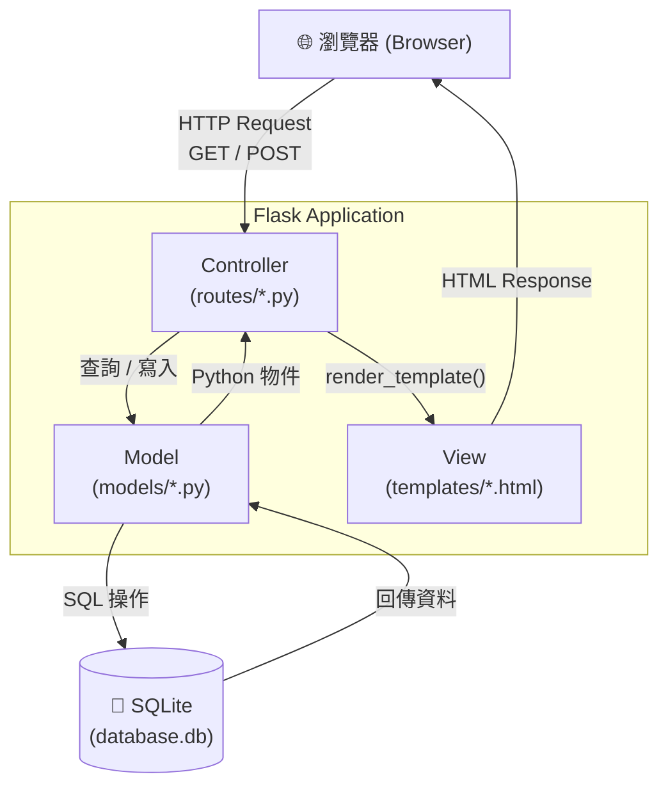

# 食譜收藏夾系統 — 系統架構文件（ARCHITECTURE）

> **版本**：v1.0　｜　**建立日期**：2026-04-15　｜　**對應 PRD**：docs/PRD.md

---

## 1. 技術架構說明

### 1.1 選用技術與原因

| 技術 | 版本建議 | 選用原因 |
|---|---|---|
| **Python** | 3.10+ | 語法簡潔、生態豐富，適合快速開發 |
| **Flask** | 3.x | 輕量級 Web 框架，學習曲線低，適合中小型專案 |
| **Jinja2** | （Flask 內建） | Flask 原生模板引擎，支援模板繼承，簡化 HTML 管理 |
| **SQLAlchemy** | 2.x | Flask 官方推薦的 ORM，防止 SQL Injection，操作資料庫更直覺 |
| **SQLite** | （Python 內建） | 零配置、單檔資料庫，個人 / 小型系統適用，無需額外安裝 |
| **Vanilla CSS** | — | 不依賴外部框架，保持輕量，完全掌控樣式 |

---

### 1.2 Flask MVC 模式說明

本專案採用 **MVC（Model-View-Controller）** 架構：

| 角色 | 對應技術 | 負責內容 |
|---|---|---|
| **Model（模型層）** | SQLAlchemy + SQLite | 定義資料表結構（食譜、菜系、食材、步驟），負責所有資料的存取與業務邏輯 |
| **View（視圖層）** | Jinja2 Templates | 負責 HTML 頁面的渲染與呈現，從 Controller 接收資料後動態填入頁面 |
| **Controller（控制層）** | Flask Routes | 接收使用者的 HTTP 請求，呼叫 Model 取得資料，再傳遞給 View 渲染回應 |

---

## 2. 專案資料夾結構

```
recipe_collection/          ← 專案根目錄
│
├── app/                    ← 主應用程式套件
│   ├── __init__.py         ← 建立 Flask app 實例、註冊 Blueprint、初始化 DB
│   │
│   ├── models/             ← 資料庫模型（Model 層）
│   │   ├── __init__.py
│   │   ├── recipe.py       ← Recipe 模型（食譜主表）
│   │   ├── cuisine.py      ← Cuisine 模型（菜系分類）
│   │   ├── ingredient.py   ← Ingredient 模型（食材清單）
│   │   └── step.py         ← Step 模型（烹飪步驟）
│   │
│   ├── routes/             ← Flask 路由（Controller 層）
│   │   ├── __init__.py
│   │   ├── recipe.py       ← 食譜的 CRUD 路由（列表、詳情、新增、編輯、刪除）
│   │   ├── cuisine.py      ← 菜系管理路由（列表、新增、刪除）
│   │   └── favorite.py     ← 喜愛切換路由（toggle 愛心狀態）
│   │
│   ├── templates/          ← Jinja2 HTML 模板（View 層）
│   │   ├── base.html       ← 基礎模板（導覽列、Footer、共用 CSS/JS）
│   │   ├── index.html      ← 首頁（食譜列表、菜系篩選、喜愛切換）
│   │   ├── recipe/
│   │   │   ├── detail.html ← 食譜詳情頁（食材、步驟、影片連結）
│   │   │   ├── form.html   ← 新增 / 編輯食譜表單
│   │   │   └── confirm_delete.html ← 刪除確認頁
│   │   └── cuisine/
│   │       └── index.html  ← 菜系管理頁
│   │
│   └── static/             ← 靜態資源
│       ├── css/
│       │   └── style.css   ← 全域樣式
│       ├── js/
│       │   └── main.js     ← 前端互動邏輯（愛心 toggle、表單動態欄位）
│       └── uploads/        ← 使用者上傳的食譜封面圖片（Should Have）
│
├── instance/               ← Flask instance 資料夾（不納入版本控制）
│   └── database.db         ← SQLite 資料庫實體檔案
│
├── docs/                   ← 文件資料夾
│   ├── PRD.md              ← 產品需求文件
│   └── ARCHITECTURE.md     ← 本架構文件
│
├── app.py                  ← 應用程式入口（啟動 Flask dev server）
├── requirements.txt        ← Python 套件依賴清單
└── .gitignore              ← Git 忽略規則（instance/、__pycache__/ 等）
```

---

## 3. 元件關係圖



**資料流說明（以「查看食譜詳情」為例）：**

1. 使用者在瀏覽器點選某道食譜
2. 瀏覽器送出 `GET /recipes/<id>` 請求給 Flask
3. `routes/recipe.py` 接收請求，呼叫 `Recipe.query.get(id)`
4. SQLAlchemy 轉換為 SQL 查詢，從 SQLite 取得食譜資料
5. Route 將資料傳入 `render_template('recipe/detail.html', recipe=recipe)`
6. Jinja2 將資料填入 HTML 模板，回傳完整頁面給瀏覽器

---

## 4. 關鍵設計決策

### 決策一：使用 Blueprint 拆分路由

**選擇**：將 `recipe`、`cuisine`、`favorite` 各自定義為 Flask Blueprint，而非全部寫在單一 `app.py`。

**原因**：
- 模組化管理，每個功能區塊獨立維護
- 隨功能增加時，不會讓 `app.py` 無限膨脹
- 符合 Flask 官方的擴充建議

---

### 決策二：使用 SQLAlchemy ORM 而非裸 SQL

**選擇**：透過 `flask-sqlalchemy` 操作資料庫，而非直接使用 `sqlite3` 模組撰寫 SQL 字串。

**原因**：
- 自動防止 SQL Injection（Parameterized Query）
- Python 物件操作更直覺，降低初學者門檻
- 未來若需要遷移至 PostgreSQL，只需修改連線字串

---

### 決策三：喜愛狀態存於 Recipe 主表

**選擇**：在 `Recipe` 資料表內加入 `is_favorite` Boolean 欄位，而非建立獨立的 Favorite 關聯表。

**原因**：
- 系統為單人使用，不需多使用者收藏功能
- 查詢更簡單，一張表即可完成「我的最愛」篩選
- 保持資料庫結構簡潔

---

### 決策四：模板繼承（Template Inheritance）

**選擇**：所有頁面繼承 `base.html`，共用導覽列、Footer 與全域 CSS。

**原因**：
- 避免重複的 HTML 結構
- 統一更新導覽列只需修改 `base.html`
- Jinja2 `` 讓每頁只需撰寫差異部分

---

### 決策五：影片連結不嵌入播放器（MVP 階段）

**選擇**：MVP 版本只儲存影片 URL，以超連結方式顯示；YouTube 嵌入縮圖為 Nice to Have。

**原因**：
- 嵌入第三方播放器需處理跨域與 iframe 安全設定，增加複雜度
- 超連結方式實作簡單且功能完整
- 不影響核心使用者需求（「點開影片教學」）

---

*此文件為動態文件，隨開發進程持續更新。*
