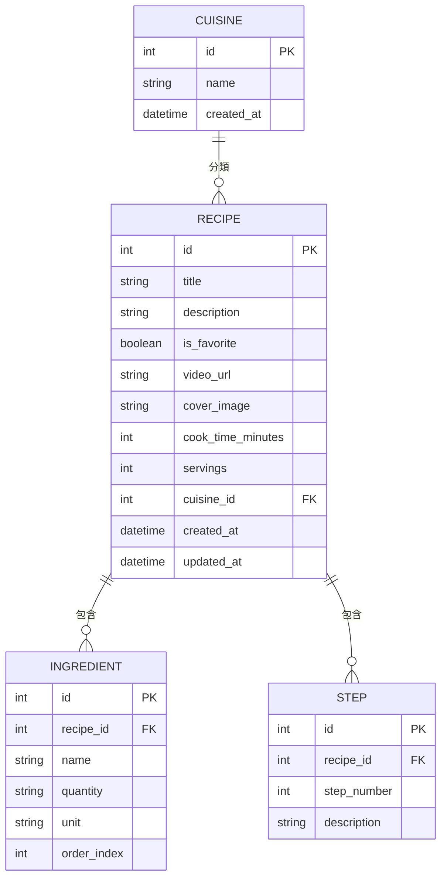

# 食譜收藏夾系統 — 資料庫設計文件（DB_DESIGN）

> **版本**：v1.0　｜　**建立日期**：2026-04-22　｜　**參考文件**：docs/PRD.md、docs/ARCHITECTURE.md、docs/FLOWCHART.md

---

## 1. ER 圖（實體關係圖）



---

## 2. 資料表詳細說明

### 2.1 `cuisines`（菜系分類表）

| 欄位名稱 | 型別 | 必填 | 說明 |
|---|---|---|---|
| `id` | INTEGER | ✅ | 主鍵，自動遞增 |
| `name` | TEXT | ✅ | 菜系名稱（如：台式、日式、義式） |
| `created_at` | DATETIME | ✅ | 建立時間，預設為當下時間 |

- **Primary Key**：`id`
- **說明**：儲存所有自訂菜系分類。每道食譜可歸屬於一個菜系（一對多）。MVP 先採固定菜系；Nice to Have 階段支援使用者自訂新增 / 刪除。

---

### 2.2 `recipes`（食譜主表）

| 欄位名稱 | 型別 | 必填 | 說明 |
|---|---|---|---|
| `id` | INTEGER | ✅ | 主鍵，自動遞增 |
| `title` | TEXT | ✅ | 食譜標題 |
| `description` | TEXT | ❌ | 食譜簡介（選填） |
| `is_favorite` | BOOLEAN | ✅ | 是否為喜愛食譜，預設 `False` |
| `video_url` | TEXT | ❌ | 影片教學連結（YouTube 等，選填） |
| `cover_image` | TEXT | ❌ | 封面圖片檔案路徑（選填，Should Have） |
| `cook_time_minutes` | INTEGER | ❌ | 預估烹飪時間（分鐘，選填，Should Have） |
| `servings` | INTEGER | ❌ | 幾人份（選填，Should Have） |
| `cuisine_id` | INTEGER | ❌ | 外鍵，關聯 `cuisines.id`；允許 NULL（未分類） |
| `created_at` | DATETIME | ✅ | 建立時間 |
| `updated_at` | DATETIME | ✅ | 最後更新時間 |

- **Primary Key**：`id`
- **Foreign Key**：`cuisine_id` → `cuisines(id)`，設定 `ON DELETE SET NULL`（菜系刪除後食譜保留，歸為未分類）
- **設計決策**：依 ARCHITECTURE.md 決策三，`is_favorite` 直接放在主表，無需獨立收藏關聯表

---

### 2.3 `ingredients`（食材清單表）

| 欄位名稱 | 型別 | 必填 | 說明 |
|---|---|---|---|
| `id` | INTEGER | ✅ | 主鍵，自動遞增 |
| `recipe_id` | INTEGER | ✅ | 外鍵，關聯 `recipes.id` |
| `name` | TEXT | ✅ | 食材名稱（如：雞蛋） |
| `quantity` | TEXT | ❌ | 份量數值（如：2、半） |
| `unit` | TEXT | ❌ | 單位（如：顆、匙、克） |
| `order_index` | INTEGER | ✅ | 顯示順序，預設依輸入順序排列 |

- **Primary Key**：`id`
- **Foreign Key**：`recipe_id` → `recipes(id)`，設定 `ON DELETE CASCADE`（食譜刪除，食材一同刪除）

---

### 2.4 `steps`（烹飪步驟表）

| 欄位名稱 | 型別 | 必填 | 說明 |
|---|---|---|---|
| `id` | INTEGER | ✅ | 主鍵，自動遞增 |
| `recipe_id` | INTEGER | ✅ | 外鍵，關聯 `recipes.id` |
| `step_number` | INTEGER | ✅ | 步驟編號（1, 2, 3...），依此排序顯示 |
| `description` | TEXT | ✅ | 該步驟的說明文字 |

- **Primary Key**：`id`
- **Foreign Key**：`recipe_id` → `recipes(id)`，設定 `ON DELETE CASCADE`（食譜刪除，步驟一同刪除）

---

## 3. 資料表關聯總覽

| 關聯 | 類型 | 說明 |
|---|---|---|
| `cuisines` → `recipes` | 一對多（1:N） | 一個菜系下可有多道食譜 |
| `recipes` → `ingredients` | 一對多（1:N） | 一道食譜有多個食材 |
| `recipes` → `steps` | 一對多（1:N） | 一道食譜有多個烹飪步驟 |

---

## 4. SQL 建表語法

完整的 CREATE TABLE 語法存放於：

```
database/schema.sql
```

包含：
- 四張資料表的 `CREATE TABLE IF NOT EXISTS`
- 外鍵設定（`ON DELETE CASCADE` / `ON DELETE SET NULL`）
- 預設菜系初始資料（`INSERT OR IGNORE INTO cuisines`）

> 執行方式（初次建立資料庫時）：
> ```bash
> flask shell
> >>> from app import db
> >>> db.create_all()
> ```

---

## 5. Python Model 程式碼

| 檔案路徑 | 對應資料表 | 說明 |
|---|---|---|
| `app/models/__init__.py` | — | 集中 import 所有 Model |
| `app/models/cuisine.py` | `cuisines` | 菜系 Model，含 CRUD 方法 |
| `app/models/recipe.py` | `recipes` | 食譜主表 Model，含 CRUD / toggle_favorite / search |
| `app/models/ingredient.py` | `ingredients` | 食材 Model，含 CRUD / bulk_replace |
| `app/models/step.py` | `steps` | 步驟 Model，含 CRUD / bulk_replace |

### 使用範例

```python
from app.models import Recipe, Ingredient, Step, Cuisine

# 新增食譜
recipe = Recipe.create(title='番茄炒蛋', cuisine_id=1)

# 批次新增食材
Ingredient.bulk_replace(recipe.id, [
    {'name': '雞蛋', 'quantity': '3', 'unit': '顆'},
    {'name': '番茄', 'quantity': '2', 'unit': '顆'},
])

# 批次新增步驟
Step.bulk_replace(recipe.id, [
    '雞蛋打散，加少許鹽巴攪拌均勻。',
    '番茄切塊備用。',
    '熱鍋後下油，炒熟雞蛋後盛起。',
    '原鍋炒番茄，加入雞蛋翻炒，調味後起鍋。',
])

# 切換喜愛狀態
Recipe.toggle_favorite(recipe.id)

# 篩選喜愛食譜
favorites = Recipe.get_all(only_favorites=True)
```

---

*此文件為動態文件，隨開發進程持續更新。*
