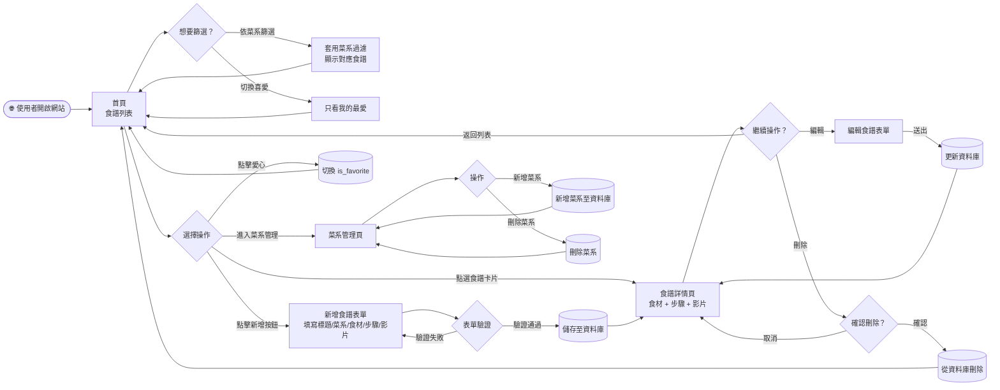
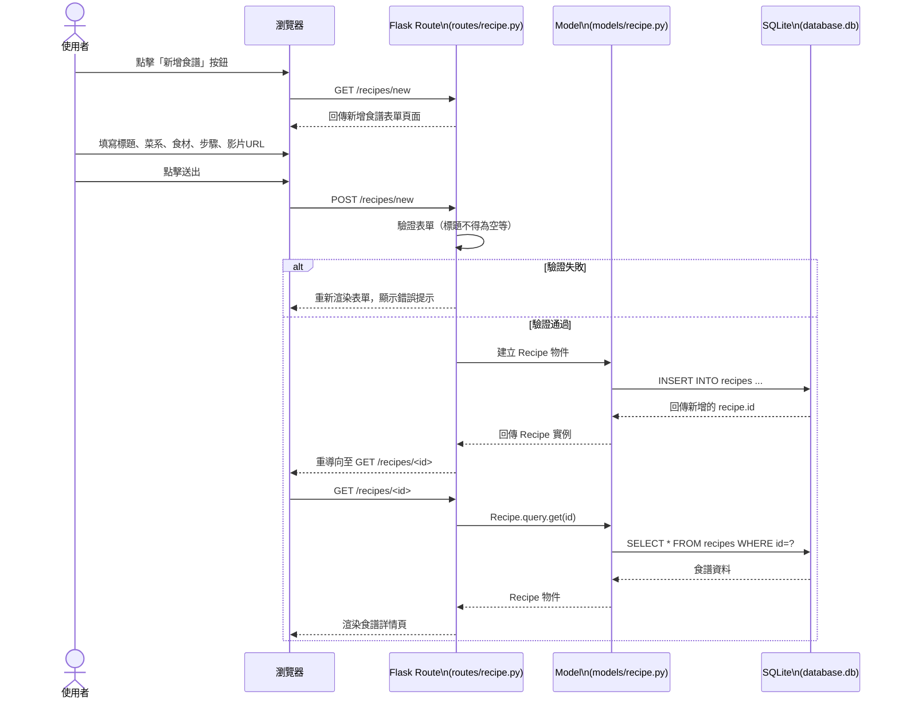
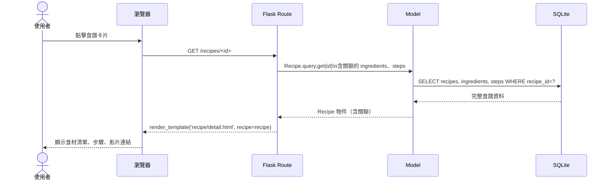
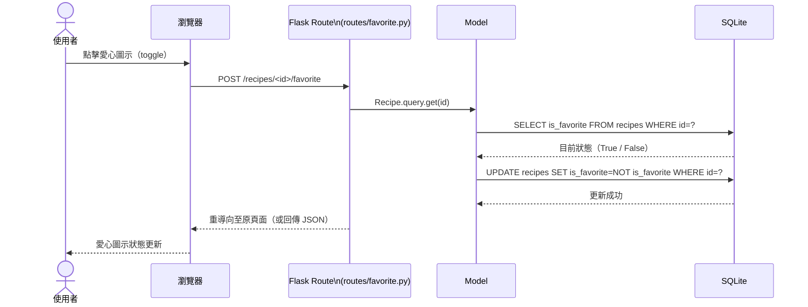
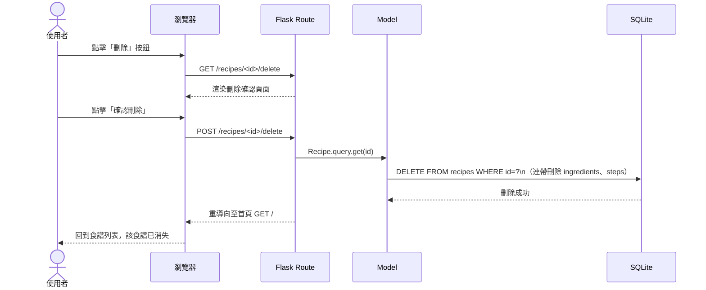

# 食譜收藏夾系統 — 流程圖文件（FLOWCHART）

> **版本**：v1.0　｜　**建立日期**：2026-04-15　｜　**參考文件**：docs/PRD.md、docs/ARCHITECTURE.md

---

## 1. 使用者流程圖（User Flow）

描述使用者從進入網站到完成各項操作的完整路徑。

---

## 2. 系統序列圖（System Sequence Diagrams）

### 2.1 新增食譜

描述使用者填寫表單到資料成功寫入資料庫的完整流程。

---

### 2.2 查看食譜詳情

---

### 2.3 切換喜愛狀態

---

### 2.4 刪除食譜

---

## 3. 功能清單對照表

| 功能 | URL 路徑 | HTTP 方法 | 對應 Blueprint |
|---|---|---|---|
| 首頁 / 食譜列表 | `/` | GET | `recipe` |
| 食譜詳情 | `/recipes/<id>` | GET | `recipe` |
| 新增食譜（表單頁） | `/recipes/new` | GET | `recipe` |
| 新增食譜（送出） | `/recipes/new` | POST | `recipe` |
| 編輯食譜（表單頁） | `/recipes/<id>/edit` | GET | `recipe` |
| 編輯食譜（送出） | `/recipes/<id>/edit` | POST | `recipe` |
| 刪除確認頁 | `/recipes/<id>/delete` | GET | `recipe` |
| 刪除食譜 | `/recipes/<id>/delete` | POST | `recipe` |
| 切換喜愛狀態 | `/recipes/<id>/favorite` | POST | `favorite` |
| 菜系管理頁 | `/cuisines` | GET | `cuisine` |
| 新增菜系 | `/cuisines/new` | POST | `cuisine` |
| 刪除菜系 | `/cuisines/<id>/delete` | POST | `cuisine` |

---

*此文件為動態文件，隨開發進程持續更新。*
